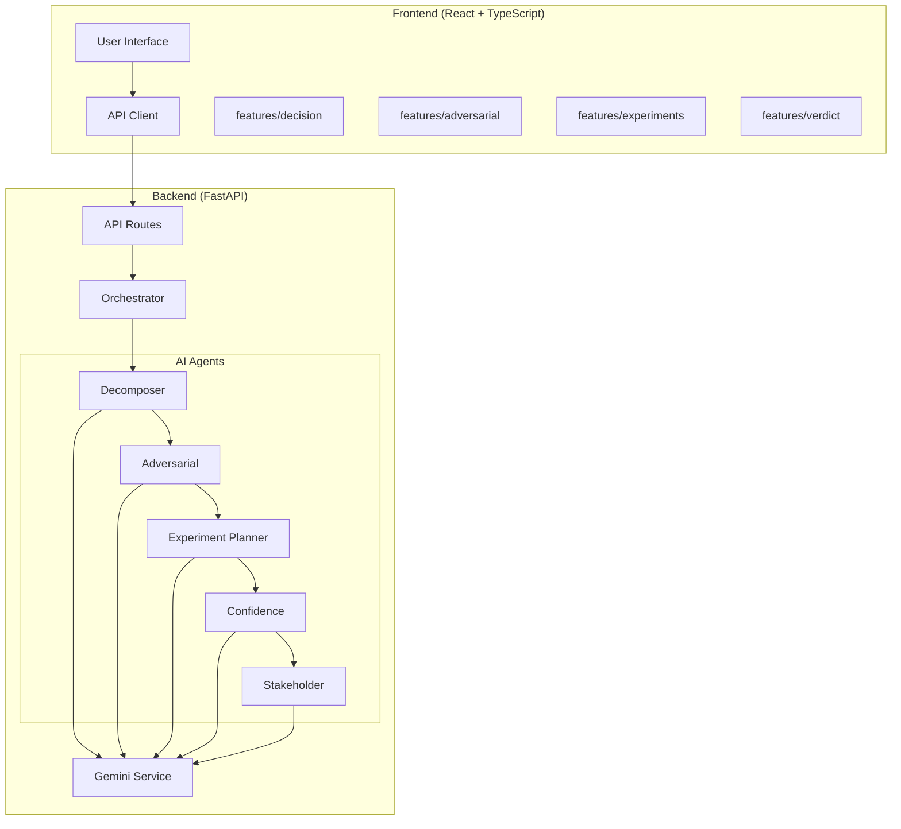

# Decision Autopilot - Architecture

## System Overview

Decision Autopilot is a multi-agent decision orchestration system that helps analyze high-stakes decisions through a pipeline of specialized AI agents.

## Architecture Diagram

## Technology Stack

| Layer | Technology |
|-------|------------|
| Frontend | React 19, TypeScript, Vite |
| Backend | Python, FastAPI, Pydantic |
| AI | Google Gemini API |
| Styling | Tailwind CSS |

## Design Principles

1. **Agent Separation**: Each AI agent has its own file with a single responsibility
2. **Feature-Based Frontend**: UI mirrors backend agent structure for easy reasoning
3. **Explicit Orchestration**: Pipeline flow is clearly defined in `orchestrator.py`
4. **Type Safety**: Pydantic (backend) and TypeScript (frontend) enforce data contracts
